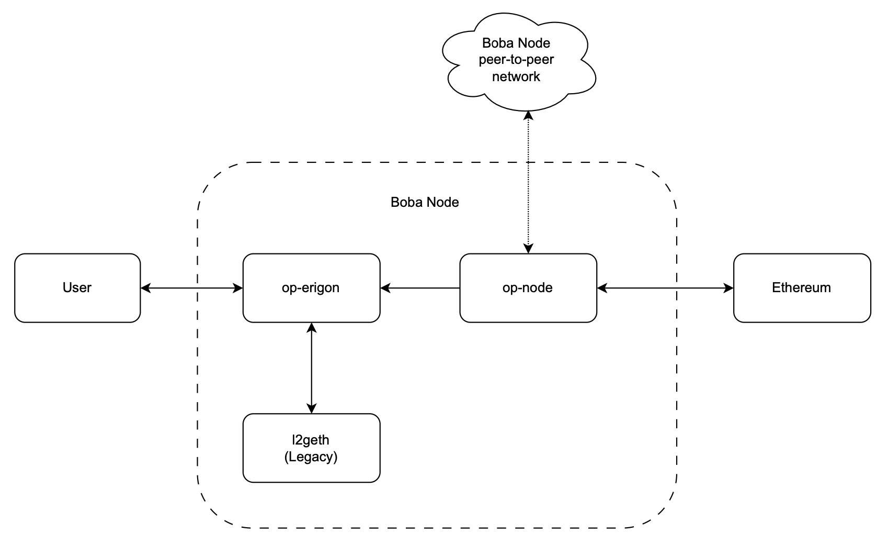

# 💻 Baremetal

## System Requirements

<table><thead><tr><th width="157" align="center">CPU</th><th align="center">OS</th><th width="166" align="center">RAM</th><th align="center">DISK</th></tr></thead><tbody><tr><td align="center">8+ cores CPU</td><td align="center">Debian 12/Ubuntu 22.04</td><td align="center">=> 16 GB RAM</td><td align="center">15GB+ (SSD or NVMe)</td></tr></tbody></table>


_The Boba Mainnet archive node has a size of 12GB on July 29, 2024_


## Boba


Boba is built on the Optimistic Rollup developed by [Optimism](https://optimism.io/).

In this guide, we are walking through the process of setting up a Boba Mainnet archive node using a forked version of Optimism's `op-erigon,` `op-node and l2geth`.  These three components must be configured together to ensure that the node can effectively serve all historical data, which may be necessary when an Indexer syncs a specific subgraph on the Boba Network


<figure><figcaption><p>Node Architecture</p></figcaption></figure>


Before you start, make sure that you have your own synced Ethereum L1 RPC URL (e.g. Erigon) and L1 Consensus Layer Beacon endpoint with **`all historical blobs data`** (e.g. Lighthouse) ready.

<mark style="color:orange;">**Hint:**</mark> [https://console.chainstack.com/user/account/create](https://console.chainstack.com/user/account/create) has a free plan enough to sync a node


## Pre-Requisites


```bash
sudo apt update -y && sudo apt upgrade -y && sudo apt autoremove -y

sudo apt install -y git make wget aria2 gcc pkg-config libusb-1.0-0-dev libudev-dev jq gcc g++ curl libssl-dev screen apache2-utils build-essential pkg-config
```


### Setting up Firewall

Set explicit default UFW rules

```bash
sudo ufw default deny incoming
sudo ufw default allow outgoing
```

Allow SSH

```bash
sudo ufw allow 22/tcp
```

Allow remote RPC connections with Blast Node

```bash
sudo ufw allow from ${REMOTE.HOST.IP} to any port 9545 8545
```


Not advised to allow all or unknown IP address to RPC port


Enable Firewall

<pre class="language-bash"><code class="lang-bash"><strong>sudo ufw enable
</strong></code></pre>

To check the status of UFW and see the current rules

```bash
sudo ufw status verbose
```

## Install dependencies

#### Required Software Dependencies

<table><thead><tr><th width="154">Dependency</th><th width="110" align="center">Version</th><th width="233">Version Check Command</th></tr></thead><tbody><tr><td><mark style="color:green;">go</mark></td><td align="center"><code>^1.21</code></td><td><code>go version</code></td></tr><tr><td><mark style="color:orange;">node</mark></td><td align="center"><code>^20</code></td><td><code>node --version</code></td></tr><tr><td><mark style="color:blue;">pnpm</mark></td><td align="center"><code>^8</code></td><td><code>pnpm --version</code></td></tr><tr><td><mark style="color:green;">foundry</mark></td><td align="center"><code>^0.2.0</code></td><td><code>forge --version</code></td></tr><tr><td><mark style="color:orange;">make</mark></td><td align="center"><code>^4</code></td><td><code>make --version</code></td></tr><tr><td><mark style="color:green;">yarn</mark></td><td align="center"><code>1.22.21</code></td><td><code>yarn --version</code></td></tr><tr><td><mark style="color:blue;">nvm</mark></td><td align="center"><code>0.39.3</code></td><td><code>nvm --verison</code></td></tr></tbody></table>

### Install GO


```bash
sudo wget https://go.dev/dl/go1.21.6.linux-amd64.tar.gz && sudo rm -rf /usr/local/go && sudo tar -C /usr/local -xzf go1.21.6.linux-amd64.tar.gz && rm go1.21.6.linux-amd64.tar.gz

#to verify Go installation
go version

#If it returns Command 'go' not found simply run 
echo 'export PATH=$PATH:/usr/local/go/bin:/root/.local/bin' >> /root/.bashrc

#and then apply changes with

source /root/.bashrc
```


### Install nvm

```bash
wget -qO- https://raw.githubusercontent.com/nvm-sh/nvm/v0.39.3/install.sh | bash
```

### Download foundry

```bash
curl -L https://foundry.paradigm.xyz | bash
```

### Install foundry

```bash
foundryup

source /root/.bashrc
```

### Install node and yarn

```bash
nvm install 18.12.0 && npm install --global yarn && nvm use 18.12.0 && npm -g install pnpm

source /root/.bashrc
```

### Check if go and all dependancies are installed

```bash
go version
nvm -v
npm -v
yarn -v
pnpm -v
```

## Build the Rollup Node (op-node)

Clone the Boba Monorepo

```bash
git clone https://github.com/bobanetwork/boba.git

cd boba
```

Check out the required release branch

Release branches are created when new versions of the `op-node` are created. Read through the [Releases page](https://github.com/bobanetwork/boba/tags) to determine the correct branch to check out.

```bash
git checkout v1.6.6
```

### Build op-node

```bash
make op-node
```

#### Create database directory and jwt secret file

```bash
mkdir /root/data/boba

openssl rand -hex 32 | tr -d "\n" > /root/data/boba/jwt.hex
```

### Create systemd service for op-node

```bash
sudo echo "[Unit]
Description=Boba op-node Service
After=network.target
StartLimitIntervalSec=60
StartLimitBurst=3

[Service]
Type=simple
Restart=on-failure
RestartSec=5
TimeoutSec=900
User=root
Nice=0
LimitNOFILE=200000
WorkingDirectory=/root/boba/op-node/bin/
ExecStart=/root/boba/op-node/bin/op-node \
  --l1={L1 RPC endpoint} \
  --l1.beacon={L1 Beacon RPC endpoint} \
  --l2=http://0.0.0.0:8551 \
  --l2.jwt-secret=/root/data/boba/jwt.hex \
  --network=boba-mainnet \
  --plasma.enabled=false \
  --rpc.addr=0.0.0.0 \
  --rpc.port=8545

KillSignal=SIGTERM

[Install]
WantedBy=multi-user.target" > /etc/systemd/system/op-node.service
```



```bash
Replace {L1 RPC endpoint} and {L1 Beacon RPC endpoint} with your synced endpoints
```



## Build Legacy Geth (l2geth)

#### Clone the Boba Legacy Monorepo and build l2geth:

```bash
cd /root/

git clone https://github.com/bobanetwork/boba_legacy.git

cd boba_legacy

cd l2geth

make geth
```

#### Create database directory for l2geth, download and extract archive snapshot:

```bash
mkdir -p /root/data/boba/boba-legacy/ && cd /root/data/boba/boba-legacy/

aria2c --file-allocation=none -c -x 10 -s 10 "https://boba-db.s3.us-east-2.amazonaws.com/mainnet/boba-mainnet-geth-db-legacy.tgz"

tar -xzvf boba-mainnet-geth-db-legacy.tgz

rm -rf boba-mainnet-geth-db-legacy.tgz

ls #to see the name of extracted archive folder

mv /root/data/boba/boba-legacy/geth-1149018/* /root/data/boba/boba-legacy/

rm -rf geth-1149018
```

#### Create systemd service for l2geth

```bash
sudo nano /etc/systemd/system/boba-legacy.service
```

Paste the configs and save by entering `ctrl+X` and `Y+ENTER`:

```bash
[Unit]
Description=Boba-legacy GETH Service
After=network.target
StartLimitIntervalSec=60
StartLimitBurst=3

[Service]
Type=simple
Restart=on-failure
RestartSec=5
TimeoutSec=900
User=root
Nice=0
LimitNOFILE=200000
WorkingDirectory=/root/data/boba/boba-legacy/

Environment=CHAIN_ID=288
Environment=NETWORK_ID=288
Environment=NO_USB=true
Environment=NO_DISCOVER=true
Environment=DATADIR=/root/data/boba/boba-legacy/
Environment=GCMODE=archive
Environment=IPC_DISABLE=true
Environment=TARGET_GAS_LIMIT=11000000
Environment=USING_OVM=true
Environment=RPC_ENABLE=true
Environment=RPC_ADDR=0.0.0.0
Environment=RPC_PORT=9546
Environment=RPC_API=eth,net,rollup,web3,debug
Environment=RPC_CORS_DOMAIN=*
Environment=RPC_VHOSTS=*
Environment=WS=false
Environment=WS_ADDR=0.0.0.0
Environment=WS_PORT=9547
Environment=WS_API=eth,net,rollup,web3
Environment=WS_ORIGINS=*
Environment=ROLLUP_BACKEND=l2
Environment=ROLLUP_VERIFIER_ENABLE=true
Environment=ROLLUP_READONLY=true
Environment=BLOCK_SIGNER_KEY=6587ae678cf4fc9a33000cdbf9f35226b71dcc6a4684a31203241f9bcfd55d27
Environment=BLOCK_SIGNER_ADDRESS=0x00000398232E2064F896018496b4b44b3D62751F
Environment=ROLLUP_ENFORCE_FEES=true
Environment=TURING_CREDIT_ADDRESS=0xF8D2f1b0292C0Eeef80D8F47661A9DaCDB4b23bf
Environment=L2_BOBA_TOKEN_ADDRESS=0xa18bF3994C0Cc6E3b63ac420308E5383f53120D7
Environment=BOBA_GAS_PRICE_ORACLE_ADDRESS=0xeE06ee2F239d2ab11792D77f3C347d919ddA0d51

ExecStart=/root/boba_legacy/l2geth/build/bin/geth \
        --datadir=/root/data/boba/boba-legacy/ \
        --allow-insecure-unlock \
        --mine \
        --miner.etherbase 0x00000398232E2064F896018496b4b44b3D62751F \
        --gcmode=archive \
        --ws=false \
        --nousb \
        --port=30301 \
        --rollup.clienthttp http://127.0.0.1:8545 \
        --rpc \
        --rpcaddr 0.0.0.0 \
        --rpcport 9546 \
        --rpcapi eth,net,rollup,web3,debug,personal \
        --rangelimit \
        --rpc.gascap 501000000

KillSignal=SIGTERM

[Install]
WantedBy=multi-user.target

```

## Build the Execution Engine (op-Erigon)

```bash
cd /root/

git clone https://github.com/bobanetwork/op-erigon.git

cd op-erigon
```

Release branches are created when new versions of the `erigon` are created. Read through the [Releases page](https://github.com/bobanetwork/op-erigon/releases) to determine the correct branch to check out.

<pre class="language-bash"><code class="lang-bash"><strong>git checkout v1.1.5
</strong>
make erigon
</code></pre>

#### Create database directory, download and extract the most recent snapshot


Consider verifying a snapshot by comparing the sha256sum of the downloaded file to the sha256sum listed on this [page](https://docs.boba.network/developer/node-operators/snapshot-downloads). Check the sha256sum of the downloaded file by running `sha256sum <filename>`in a terminal


```bash
mkdir /root/data/boba/op-erigon

cd /root/data/boba/op-erigon

aria2c --file-allocation=none -c -x 10 -s 10 "https://boba-db.s3.us-east-2.amazonaws.com/mainnet/boba-mainnet-erigon-db-1149019.tgz"

tar -xzvf boba-mainnet-erigon-db-1149019.tgz #extract archive

rm -rf boba-mainnet-erigon-db-1149019.tgz #remove archive

mv /root/data/boba/op-erigon/boba-mainnet-erigon-db-1149019/* /root/data/boba/op-erigon/ #Move database files into our database directory path

rm -rf boba-mainnet-erigon-db-1149019 #remove empty folder
```

### Create systemd service for op-erigon

```bash
sudo echo "[Unit]
Description=op-erigon Service
After=network.target
StartLimitIntervalSec=200
StartLimitBurst=5

[Service]
Type=simple
Restart=on-failure
RestartSec=5
TimeoutSec=900
User=root
Nice=0
LimitNOFILE=200000
WorkingDirectory=/root/op-erigon/build/bin/
ExecStart=/root/op-erigon/build/bin/erigon \
  --datadir=/root/data/boba/op-erigon \
  --private.api.addr=localhost:9090 \
  --metrics \
  --metrics.addr=0.0.0.0 \
  --metrics.port=9700 \
  --http.addr=0.0.0.0 \
  --http.port=9545 \
  --http.corsdomain=* \
  --http.vhosts=* \
  --ws --ws.compression \
  --rpc.returndata.limit 1000000 \
  --authrpc.addr=127.0.0.1 \
  --authrpc.port=8551 \
  --authrpc.vhosts=* \
  --authrpc.jwtsecret=/root/data/boba/jwt.hex \
  --chain=boba-mainnet \
  --http.api=eth,erigon,debug,net,trace,engine,web3 \
  --txpool.gossip.disable=true \
  --rollup.sequencerhttp=https://mainnet.boba.network \
  --rollup.historicalrpc=http://127.0.0.1:9546 \
  --db.size.limit=8TB
KillSignal=SIGTERM

[Install]
WantedBy=multi-user.target" > /etc/systemd/system/op-erigon.service
```

### Start BOBA

#### Start op-erigon


It's usually simpler to begin with starting`op-erigon` before you start `op-node`. You can start `op-erigon` even if `op-node` isn't running yet, but `op-erigon` won't get any blocks until `op-node` starts.


```bash
sudo systemctl daemon-reload #refresh systemd configuration when changes made

sudo systemctl enable op-erigon.service #enable op-erigon service at system startup

sudo systemctl start op-erigon.service #start op-erigon

sudo nano /etc/systemd/system/op-erigon.service #make changes in op-erigon.service file
```

#### Start op-node


Once you've started `op-erigon`, you can start `op-node`. `op-node` will connect to `op-erigon` and begin synchronizing the BOBA network. `op-node` will begin sending block payloads to `op-erigon` when it derives enough blocks from Ethereum


```bash
sudo systemctl daemon-reload #refresh systemd configuration when changes made

sudo systemctl enable op-node.service #enable op-node service at system startup

sudo systemctl start op-node.service #start op-node

sudo nano /etc/systemd/system/op-node.service #make changes in op-node.service file
```

#### Start l2geth

```bash
sudo systemctl daemon-reload #refresh systemd configuration when changes made

sudo systemctl enable boba-legacy.service #enable l2geth service at system startup

sudo systemctl start boba-legacy.service #start l2geth

sudo nano /etc/systemd/system/boba-legacy.service #make changes in boba-legacy.service file
```

### Monitor the logs for errors

```bash
sudo journalctl -fu op-node.service #follow logs of op-node.service

sudo journalctl -fu op-erigon.service #follow logs of op-erigon.service

sudo journalctl -fu boba-legacy.service #follow logs of boba-legacy.service
```

During the initial synchonization, you are expected to get following log messages from `op-node`

```bash
INFO [08-04|16:36:07.150] Advancing bq origin                      origin=df76ff..48987e:8301316 originBehind=false
```

After a few minutes, `op-node` finds the right batch and then it starts synchronizing. During this synchonization process, you get log messags from `op-node`

```bash
INFO [08-04|16:36:01.204] Found next batch                         epoch=44e203..fef9a5:8301309 batch_epoch=8301309                batch_timestamp=1,673,567,518
INFO [08-04|16:36:01.205] generated attributes in payload queue    txs=2  timestamp=1,673,567,518
INFO [08-04|16:36:01.265] inserted block                           hash=ee61ee..256300 number=4,069,725 state_root=a582ae..33a7c5 timestamp=1,673,567,518 parent=5b102e..13196c prev_randao=4758ca..11ff3a fee_recipient=0x4200000000000000000000000000000000000011 txs=2  update_safe=true
```

### Run _`curl`_ command in the terminal to check the status of your node

```bash
curl -H "Content-type: application/json" -X POST --data '{"jsonrpc":"2.0","method":"eth_syncing","params":[],"id":1}' http://localhost:9545
```

If it returns `false` then your node is fully synchronized with the network

### References








