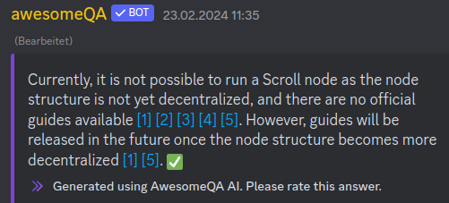

# 🐳 Scroll - Docker

## System Requirements

| CPU   | OS        | RAM    | DISK            |
| ----- | --------- | ------ | --------------- |
| 4c/8t | Debian 12 | >=16GB | >= 1TB SSD/NVME |

Only tested with Debian 12 but should run on every OS that can run Docker

## Prerequisites

If not already installed. Install docker ([LINK](https://docs.docker.com/engine/install/debian/)).&#x20;

## Scroll

#### Preamble

* Scroll does not provide official documentation on running a node.
* Scroll does not encourage to run a node:\
  \
  But don't worry. Keep reading.

#### Useful Links

Discord Server: [https://discord.gg/99ERMfPC](https://discord.gg/99ERMfPC)\
Github: [https://github.com/scroll-tech/](https://github.com/scroll-tech/)\
Unoffical Docs:&#x20;

* Running a [Node](https://scrollzkp.notion.site/Running-a-Scroll-L2geth-Node-Scroll-Mainnet-9d7b8aa810fc4cc4ae4add8b707a392d#6d5d8f157b6243128dbe2742a2bc272c)
* [Namespace](https://scrollzkp.notion.site/Scroll-RPCs-scroll-namespace-e756b0df98fe42cda8a707083486f9e8)

#### Create docker-compose.yml

`nano docker-compose.yml`



```javascript
version: "3.1"
services:
  scroll:
    container_name: scroll
    image: scrolltech/l2geth:scroll-v5.1.10
    restart: unless-stopped
    volumes:
      - scroll:/scroll-datadir
    ports:
      - 8545:8545
    command: |
      --scroll
      --datadir "./scroll-datadir"
      --gcmode archive
      --syncmode full
      --cache.noprefetch
      --http
      --http.corsdomain "*"
      --http.vhosts "*"
      --http.addr "0.0.0.0"
      --http.port 8545
      --http.api "eth,net,web3,debug,scroll"
      --l1.endpoint "https://eth.llamarpc.com"
      --rollup.verify
      --l1.confirmations finalized
      --verbosity=3
      --metrics
      --metrics.addr "0.0.0.0"
      --metrics.port 6060
      --maxpeers 100
      --nat "extip:0.0.0.0"
      --port 30303

volumes:
  scroll:

```



```python
message = "hello world"
print(message)
```



```ruby
message = "hello world"
puts message
```



#### Start the container

docker compose up -d&#x20;


#### Userful tips

View Logs via

`docker logs -f scroll`

Get Sync status via (replace $YOURIP$ with the IP of your server)

`curl -H "Content-type: application/json" -X POST --data '{"jsonrpc":"2.0","method":"eth_syncing","params":[],"id":1}' $YOURIP$:8545`

`curl -H "Content-type: application/json" -X POST --data '{"jsonrpc":"2.0","method":"scroll_syncStatus","params":[],"id":1}' $YOURIP$:8545`


